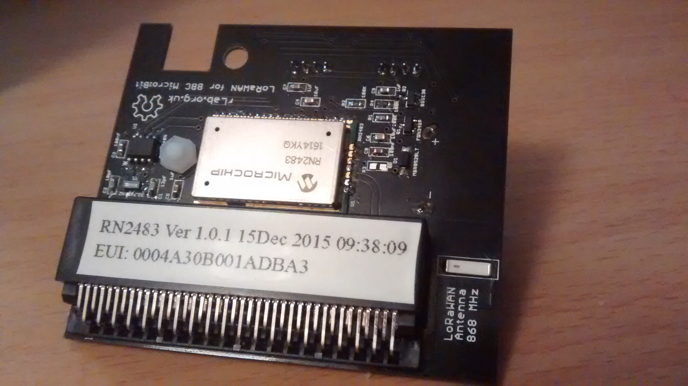
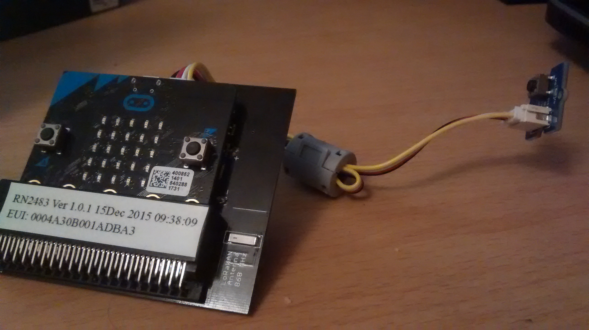

# Challenge 3
Transmits a reading of the MicroBit's thermometer via LoRa whenever the connected Grove Button is pressed.

**MicroBit RN2483 Shield required** (_ask B.Gaster_)

## Contents
1. Overview
2. Setup
3. Running
4. Enviroment
5. Authors

## Overview
This is a small demo for the RN2483 library and Grove framework included.

It was developing using the MicroBit RN2483 shield (see Setup), this isn't required for the demo to work but it makes like _a lot_ easier. Otherwise you'll need to connect the pins manually, see Setup for pin mapping bits.

The demo starts by initialising itself and the RN2483 module. If this succeeds, the demo then attempts to join a LoRa network. **You'll need to be in range of a LoRaWAN gateway and have your device registered to it's LoRaWAN network to succeed.** Then it'll enter the the main loop and wait for you to press the connected Grove Button, once you do, it should read from the MicroBit's thermometer and tx it over LoRa in a confirmed uplink. If any downlink data is recieved, it'll scroll it across the display.

**Check rn2483/config.h if you want to change the LoRaWAN keys & ids used**


#### External Modules
These are external modules that this demo is using (that I wrote):

1. The RN2483 library is written in C and provides users with an interface to the RN2483 module, for more details see the README: https://github.com/GeaRSiX/General-Platform-RN2483-Library/blob/platform/mbit/README.md

2. The Grove framework is written in C++ and provides a simple framework for using an supported Grove Module. For more details see the README: https://github.com/GeaRSiX/General-Platform-Grove-Framework/blob/platform/mbit/README.md

3. For more details on the relevant projects used, see their respective GitHub repos:
	* https://github.com/GeaRSiX/General-Platform-RN2483-Library
	* https://github.com/GeaRSiX/General-Platform-Grove-Framework
	* https://github.com/GeaRSiX/MicroIMG-library

## Running
1. Plug the MicroBit into the shield (see images in Setup)
2. Plug a Grove Button module into the shield (I/O port)
3. After it's finished initialising, you'll see a dot scroll across the screen
	* ```init``` and ```join``` will scroll across the screen during initialisation
	* If a tick cross displays, an error occoured and it'll exit. Else a tick will be displayed
4. Press the button, and it should TX a temperature reading from the MicroBit's thermometer via the RN2483


## Setup
As stated in the overview, this is **a lot** easier with the RN2483 shield (see image below). If not you'll have to find a way to connect the components to their respective pins, see Pin Mapping for details on this.

### LoRaWAN configuration
1. You need to be in range of a LoRaWAN gateway for this to work
2. Edit ```rn2483/config.h``` to meet the LoRaWAN settings of your registered LoRaWAN device
	* The current settings in ```rn2483/config.h``` are the ones I was using. They _might_ still work if you've got the same RN2483 chip and I've not deleted the device from my TTN account. Otherwise, use them as an example.

### Accessing the data
* I was using TTN as my LoRaWAN network, so I was able to access the data by integrating ```Data Storage``` with my Application, and making a HTTP GET request with the right headers
**This curl doesn't include the Authorization header used to access the data, so it'll return ```Not Authorized```**.
```
curl -X GET --header 'Accept: text/plain' 'https://student-diss.data.thethingsnetwork.org/api/v2/query/demo'
```

### Pin Mappings
|Module Pin|MicroBit Pin|
|---|---|
|RN2483_TX|MICROBIT_PIN_P12|
|RN2483_RX|MICROBIT_PIN_P8|
|RN2483_RESET|MICROBIT_PIN_P2|
|GROVE_BUTTON|MICROBIT_PIN_P1|

### MicroBit shield
Here are images of the MicroBit shield.
* Shield (unconnected)


* Shield (connected)



## Authors
**Alexander Collins** - [14029202]